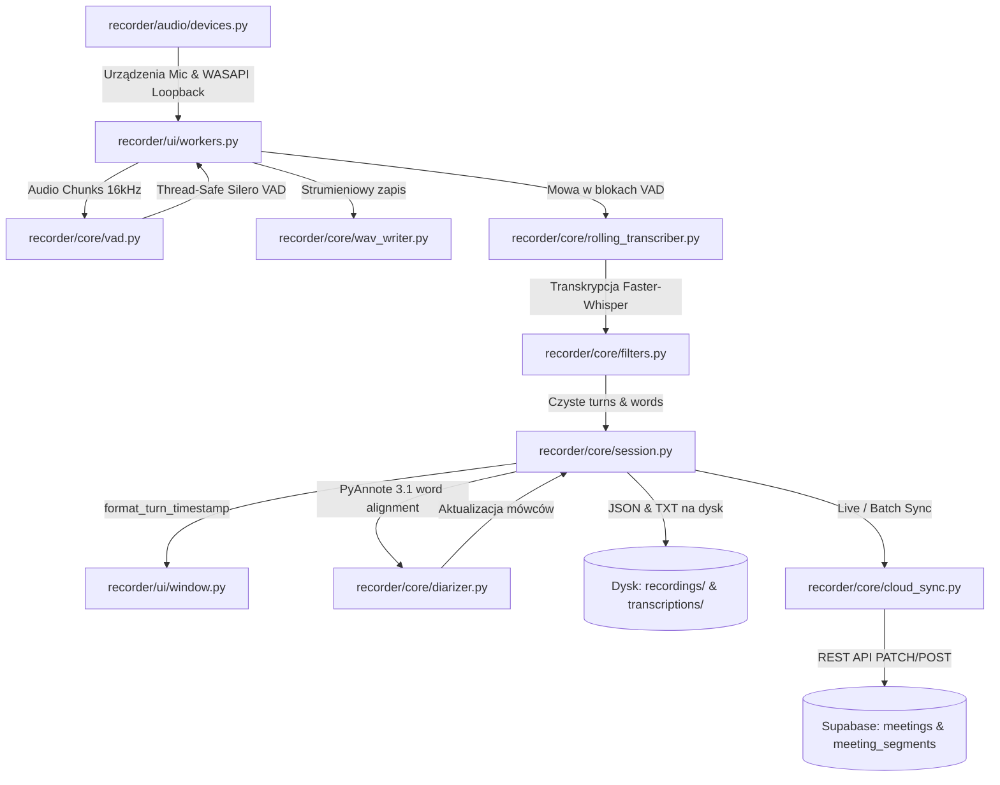

# 🧭 RECORDER67 — ARCHITEKTURA, MAPA POWIĄZAŃ I KONTRAKTY SYSTEMU

> **DLA AGENTA AI:** Niniejszy plik jest ładowany na początku każdej sesji i nowego czatu. Zawiera kompletną mapę powiązań komponentów, przepływ danych oraz żelazne reguły architektoniczne (*invariants*), których **nie wolno łamać** przy wprowadzaniu nowych funkcji i refaktoryzacji.

---

## 🗺️ 1. Mapa Powiązań Modułów (Component Dependency Map)

---

## 🔒 2. Żelazne Reguły Architektoniczne (System Invariants)

### ⏱️ REGUŁA 1: Formatowanie i Obieg Znaczników Czasu (Timestamp Contract)
1. **Pojedyncze źródło prawdy formatowania:**
   - Wszystkie moduły (`session.py`, `rolling_transcriber.py`, `diarizer.py`, `speakers.py`, `window.py`) **MUSZĄ** używać funkcji `format_turn_timestamp(st, en, session_start_time)` z `recorder.core.session`.
   - **ZAKAZ** wprowadzania sztywnych formatów typu `f"[{st:.1f}s - {en:.1f}s]"` lub samego `f"[{s_min}:{s_sec}]"`.
2. **Obsługiwane formaty użytkownika (`timestamp_format`):**
   - `"clock_only"` -> `[15:43:54 - 15:44:01]` (wyliczana jako `session_start_time + timedelta(seconds=offset)`).
   - `"offset+clock"` -> `[00:19 - 00:26 | 15:43:54 - 15:44:01]` (hybryda).
   - `"offset_only"` -> `[00:19 - 00:26]` (tylko czas od początku audio).
3. **Odczyt z dysku w UI (Podwójne kliknięcie na liście):**
   - W `_on_transcription_double_clicked()` **ZAWSZE** najpierw ładuj powiązany plik `session.json` i generuj HTML przez `sess.export_to_html(session_start_time=session_dt)`.
   - Parser `parse_txt_to_turns()` jest jedynie rezerwowym fallbackiem dla zewnętrznych plików `.txt` i musi obsługiwać regexem wszystkie 3 powyższe formaty.

---

### 🎙️ REGUŁA 2: Dźwięk Dwukanałowy i Bezpieczeństwo Wątkowe (Audio & PortAudio Safety)
1. **Wspólna instancja `pyaudiowpatch`:**
   - W `recorder/ui/workers.py` **NIGDY** nie twórz osobnych instancji `sounddevice` i `pyaudiowpatch` w tym samym procesie (powoduje to crash `0xC0000374` PortAudio DLL heap corruption).
   - Obydwa strumienie (`mic_stream` i `loop_stream`) muszą korzystać z tej samej instancji `pyaudiowpatch` (`self.p_audio`).
2. **Blokada Silero VAD:**
   - W `recorder/core/vad.py` inferencja Torch JIT `_silero_model` **MUSI** być otoczona blokadą `with _silero_lock:` (jednoczesne wywołanie z wątku mikrofonu i wątku loopback powoduje access violation `0xC0000005`).

---

### 👥 REGUŁA 3: Diaryzacja PyAnnote 3.1
1. **Autoryzacja HuggingFace:**
   - Używaj `Pipeline.from_pretrained("pyannote/speaker-diarization-3.1", use_auth_token=token)`.
2. **Parametry wywołania:**
   - **NIE** przekazuj `batch_size` do `pipeline(audio_path)` (PyAnnote 3.1 tego nie obsługuje i rzuca `TypeError`).
   - Wydajnością steruj wyłącznie przez `torch.set_num_threads(safe_threads)`.
3. **Zatwierdzanie imion mówców:**
   - W `_on_apply_speakers_clicked()` zawsze przekazuj `session_start_time` do `format_turns()` i aktualizuj mapowanie w pliku `session.json`.

---

### ☁️ REGUŁA 4: Baza Danych i Supabase Sync
1. **Tabela `meeting_segments`:**
   - `start_time` i `end_time` to zawsze liczby `float` (sekundy).
   - `speaker_name` to string (np. `Tomasz`, `Mówca 1`, `🎧 Dźwięk Systemu`).
2. **Tabela `meetings`:**
   - `created_at`: ISO-8601 UTC string z końcówką `Z` (np. `2026-09-01T13:45:00.000Z`).
   - `transcript`: pełny tekst z podziałem na role sformatowany według preferencji użytkownika.
   - Aktualizacje po diaryzacji/edycji mówców wykonywane są metodą `PATCH` po `id=eq.{meeting_id}` (bez duplikowania rekordów).

---

### 🛡️ REGUŁA 5: Prywatność, Git Workflow i Środowisko Windows (Learned Lessons)
1. **Bezwzględna Ochrona Prywatności:**
   - Pod żadnym pozorem nie umieszczać fragmentów rzeczywistych rozmów biznesowych z klientami w kodzie źródłowym, komentarzach, docstringach, testach jednostkowych ani w commitach.
   - Wszystkie przykłady dialogów, imion i poleceń w kodzie muszą być w 100% zanonimizowane i generyczne (np. Jan, Piotr, Tomasz, Anna).
   - Pliki `.txt`, nagrania `.wav` oraz folder `scratch/` muszą pozostać wykluczone w `.gitignore`.
2. **Git Workflow, Lokalne Commity i Ochrona Mastera:**
   - **Lokalne commity na gałęziach funkcyjnych:** Dozwolone i zalecane! Po zrealizowaniu logicznego fragmentu prac (np. ukończeniu kamienia milowego lub podzadania) należy utworzyć lokalny `git commit` z czytelnym komunikatem (np. `feat(ui): ...`, `fix(...)`). Tworzenie lokalnych commitów zabezpiecza postęp prac przed utratą (np. w razie wyczerpania limitu sesji) i ułatwia przegląd historii zmian.
   - **Bezwzględna ochrona zdalnego repozytorium i mastera:** ZAKAZ wykonywania `git push` do zdalnego repozytorium oraz zakaz dotykania/merge'owania do gałęzi `master` (lub `main`) bez wyraźnej, bezpośredniej prośby lub zgody użytkownika.
3. **Samouczenie Agenta:**
   - Asystent ma stałą zgodę na proaktywne aktualizowanie ustaleń technicznych i zasad bezpośrednio w tym pliku `.agents/rules/architecture.md`.
4. **Sprzęt i Optymalizacje Audio w Windows:**
   - **Hollyland LARK MAX 2:** Odbiornik po USB w Windows sumuje sygnał do mono/stereo (nie ma 4 fizycznych urządzeń wejściowych) – w 100% polegamy na programowej diaryzacji `pyannote.audio` + panelu autosugestii w UI.
   - Unikać zależności od zewnętrznego systemowego `ffmpeg` – stosować wbudowane mechanizmy `soundfile` do bezpośredniego wczytywania tablic float32 do `faster-whisper`.
   - Stosować `apply_av_patches()` oraz `apply_torchaudio_patches()` omijające błędy DLL i ograniczenia PyTorch 2.6+ `weights_only`.

---

### ✍️ REGUŁA 6: Czysty Język, Styl Komunikacji i Redagowania Treści
1. **Zakaz sztucznych, redundantnych nawiasów:**
   - **BEZWZGLĘDNY ZAKAZ** dopisywania w nawiasach angielskich tłumaczeń lub korpo-żargonu (np. `(Background & Objective)`, `(*Action Items*)`, `(New Features)`, `(Timeline Alignment)`, `(Fixes & Improvements)`).
   - Treści tworzone dla użytkownika (opisy wydań, issues, dokumentacja, wiadomości) muszą być pisane w czystym, naturalnym języku polskim. Jeśli pojęcie ma polski odpowiednik (*Kontekst i cel*, *Lista zadań*, *Nowości*, *Poprawki*), używamy wyłącznie polskiego określenia.
2. **Naturalny i zwięzły ton:**
   - Komunikaty i propozycje wiadomości mają brzmieć po ludzku, profesjonalnie i konkretnie, bez sztucznego lania wody i zbędnych ozdobników.

---

## 🛠️ 3. Lista Kontrolna Przed Wdrożeniem Zmian (Pre-Change Checklist)

Przed zakończeniem dowolnego zadania programistycznego w tym projekcie upewnij się, że:
- [ ] Zmiana nie zaburzyła formatowania timestampów w 4 kluczowych punktach:
  1. Live transcription podczas nagrywania.
  2. Wynik po diaryzacji PyAnnote.
  3. Kliknięcie *„Zastosuj imiona mówców i zapisz”*.
  4. Dwukrotne kliknięcie na liście zapisanych plików w UI.
- [ ] Nie zmieniono pojedynczej instancji `pyaudiowpatch` na osobne biblioteki audio.
- [ ] Zmiana zachowuje spójność plików sesji `.json` oraz tekstu `.txt`.
- [ ] Nie pozostawiono rzeczywistych danych ani nagrań w repozytorium.