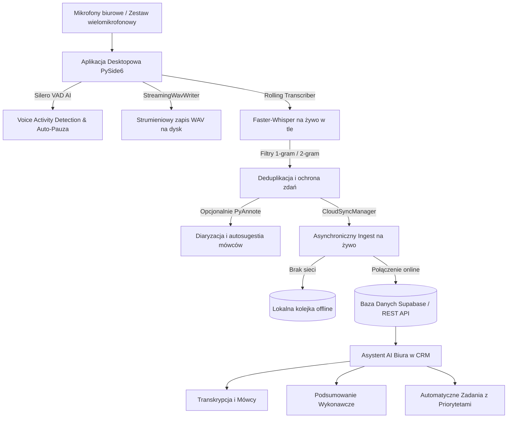

# Projekt: Inteligentny Asystent Biurowy AI (Ambient AI & Recorder)

> **UWAGA:** Niniejszy dokument stanowi żywe źródło wiedzy i celów projektowych (Project Memory / Agent Context). Może być modyfikowany, rozszerzany i aktualizowany w trakcie rozwoju projektu wraz ze zmianą wymagań lub założeń architektonicznych.

---

## 1. Główny Cel Projektu (Objective)
Budowa systemu **Ambient AI** dla biura, który w sposób ciągły, inteligentny i zoptymalizowany pod kątem zasobów:
1. Rejestruje mowę z mikrofonów w biurze (z automatycznym pomijaniem ciszy przez Silero VAD i natychmiastowym strumieniowaniem WAV na dysk).
2. Transkrybuje mowę na żywo w tle (asynchroniczny Rolling Transcriber oparty na `faster-whisper` z buforem mowy, deduplikacją słów i filtrami anty-halucynacyjnymi).
3. Opcjonalnie separuje mówców (diaryzacja PyAnnote + autosugestia imion na podstawie kontekstu rozmów).
4. Przesyła dane na żywo (Live Streaming) do bazy danych Supabase / REST API / CRM z odpornością na brak internetu (kolejka offline).
5. Zasila moduł **Asystenta AI Biura w systemie CRM**, który na bieżąco generuje:
   - Podgląd transkrypcji na żywo z podziałem na role i sygnaturami czasowymi.
   - Podsumowanie wykonawcze (Executive Summary) i kluczowe ustalenia spotkania.
   - Listę zadań do wykonania (Action Items) z automatycznym przypisaniem priorytetów (Krytyczny, Wysoki, Średni) oraz osób odpowiedzialnych.
6. Automatycznie dzieli sesje po zadanym czasie ciągłej ciszy (Smart Session Splitting, np. 15 minut) bez przerywania nasłuchu.

---

## 2. Architektura Systemu i Komponenty

---

## 3. Status Realizacji: Co jest ZROBIONE vs Roadmapa

### ✅ ZROBIONE (Stan obecny w repozytorium):
- [x] **Aplikacja Desktopowa GUI (PySide6)**: Nowoczesny interfejs, wskaźniki VU meter poziomu głośności, zegar nagrywania, zarządzanie plikami nagrań i transkrypcji.
- [x] **Silero VAD (Voice Activity Detection)**: Detekcja mowy AI w czasie rzeczywistym, pre-padding zapobiegający ucinaniu słów, regulacja progu ciszy i auto-wznawianie.
- [x] **Asynchroniczna Transkrypcja na Żywo (Rolling Transcriber)**: Silnik `faster-whisper` (`small`, `medium`, `large-v3-turbo`) przetwarzający bloki mowy w tle, z automatycznym doborem akceleracji CUDA `float16` lub CPU `int8`.
- [x] **Zaawansowane Filtry Anty-Halucynacyjne i Deduplikacja**:
  - Eliminacja patologicznych pętli 1-słownych i 2-słownych (`1-gram` i `2-gram`, np. zacięcia na słowach *„nie”*, *„tak”*, *„nie ma”*, *„KONIEC”*, *„ha, ha”*).
  - Ochrona zdań mieszanych (zachowanie wartościowego początku zdania, odcięcie zapętlonej końcówki).
  - Wycinanie plansz YouTube i halucynacji systemowych.
  - Prawidłowa synchronizacja obiektów `Word` ze znacznikami czasu na osi czasu.
- [x] **Optymalizacja Pamięci RAM**:
  - Natychmiastowe zwalnianie buforów audio `block.audio_float = None` po przetworzeniu.
  - Strumieniowy zapis na dysk (`StreamingWavWriter`) bez akumulacji pamięci w długich sesjach.
- [x] **Smart Session Splitting (Auto-podział sesji biurowych)**:
  - Automatyczne domykanie i finalizacja spotkania po 15 min ciągłej ciszy.
  - Płynne otwieranie nowego pliku nagrania i nowej sesji w CRM bez konieczności ponownego ładowania modelu Whisper (0 ms opóźnienia).
- [x] **Integracja Chmurowa i CRM (Cloud Sync)**:
  - Asynchroniczny przesył segmentów na żywo do Supabase / Webhooka z trwałymi identyfikatorami UUID, buforem ponawiania prób bez utraty danych i bezwzględną deduplikacją O(1).
  - Obsługa kolejki offline z automatycznym dosłaniem danych po powrocie internetu.
- [x] **Separacja i Autosugestia Mówców (Diarization)**:
  - Integracja z `pyannote.audio` (model `speaker-diarization-3.1`) z możliwością uruchomienia wyłącznie diaryzacji na gotowych słowach sesji JSON bez ponownego uruchamiania Whispera.
  - Panel autosugestii imion na podstawie kontekstu wypowiedzi.
- [x] **Kontrola Prywatności w GUI (Manual Pause / Stop)**: Dedykowane przyciski *„Wstrzymaj Ręcznie”* oraz *„Stop i Zapisz”* pozwalające na natychmiastowe zatrzymanie nasłuchu mikrofonu i transmisji danych w dowolnym momencie.
- [x] **Wgrywanie Gotowych Plików Audio/Wideo**: Obsługa formatów WAV, MP3, M4A, FLAC, OGG, AAC, MP4, MKV z normalizacją 16kHz mono i natychmiastowym autozapisem TXT/JSON.
- [x] **Hybrydowe Źródła Audio (Mikrofon + WASAPI Loopback)**: Niezależne lub równoległe rejestrowanie mikrofonu oraz dźwięku systemu/spotkań (Discord, MS Teams, Zoom), izolacja procesu audio (`TargetAppAudioMonitor`), suwaki VU i niezależne przyciski wyciszenia MUTE w locie.
- [x] **Inteligentny System Ostrzeżeń o Braku Dźwięku**: Wykrywanie przedłużającego się braku mowy i dźwięku w aktywnej sesji (domyślnie 5 min, regulacja 1–20 min), kompaktowy baner Toast z przyciskami *«Wszystko gra»* / *«Sprawdź dźwięk»*, zintegrowany z Centrum Akcji Windowsa (z priorytetem alarmu przebijającym tryb *Nie przeszkadzać*) i tłumieniem dźwięków powiadomienia w nagraniu.
- [x] **Natywna Integracja z Windows & Oficjalna Ikona Fluent**: Zarejestrowana tożsamość procesu `InteligentnyDyktafonAI`, dedykowana przezroczysta ikona aplikacji, zasobnik systemowy (Tray) z menu podręcznym i przywracaniem okna lewym klikiem.
- [x] **Stabilizacja Maratonów Nagraniowych (4h–8h) & Skalowalność Pamięci RAM do O(1)**:
  - Eliminacja wycieków pamięci i asymetrii buforów w mikserze audio `RealtimeAudioMixer`.
  - 30-sekundowy throttling zapisu dyskowego I/O (zmniejszenie obciążenia dysku SSD o 95% przy wielogodzinnych sesjach).
  - Ochrona interfejsu (Catch-up Mode) zapobiegająca zamrażaniu widżetu przy tysiącach bloków mowy.
  - Opcjonalny bieg turbo (Adaptacyjny Whisper Turbo) dynamicznie przyspieszający inferencję (`beam_size=1`) przy zatorach w kolejce z zachowaniem bazowej precyzji (`beam_size=5`).
  - Natychmiastowe wypychanie mowy przy wyciszeniu (Flush on Mute) oraz bufor pre-speech eliminujący ucinanie głosek.
  - Pętla retry dla urządzeń WASAPI Bluetooth rozwiązująca błąd `[Errno -9996] Invalid device`.
  - Samonaprawiający się Watchdog audio: wielostopniowe wznawianie zawieszonych buforów urządzeń (Hollyland, mikrofony USB/Bluetooth) w locie bez utraty sesji nagrania.
  - Czysta lista mikrofonów: automatyczna deduplikacja urządzeń audio w GUI, filtr mapperów Windows i priorytetyzacja natywnego WASAPI z fallbackiem.
  - Płynny stoper zegarowy z akumulatorem monotonicznym 200 ms.
- [x] **Nowoczesny Auto-Updater z Paskiem Postępu (WinForms GUI)**: Graficzne okno instalatora PowerShell WinForms z wizualnym paskiem postępu i komunikatami o poszczególnych etapach instalacji w locie (in-place update z automatycznym restartem i fallbackiem wsadowym).
- [x] **Bogaty Changelog Markdown & Przeglądarka Historii**: Obsługa pełnego formatowania CommonMark w oknie Ustawień, wielowersyjna agregacja pominiętych wydań, elastyczny scroll area i przeglądanie starszych wersji.
- [x] **Wydanie Produkcyjne bez Konsoli & Centralne Bezpieczne Logowanie**: Aplikacja skompilowana z flagą `--noconsole`, automatyczne przechwytywanie strumieni stdout/stderr do rotującego pliku dziennika `logs/app.log` (do 60 MB) oraz 100% automatyczne maskowanie kluczy API, haseł i webhooków.
- [x] **Budowanie wersji instalacyjnej**: Skrypty PyInstaller (`build_exe.ps1` i `scripts/build_exe.py`) do generowania gotowego pliku `.exe` pod Windows.
- [x] **System Motywów Graficznych i Personalizacja UI**: Centralny silnik QSS z 4 kompletymi motywami (Classic Dark, Classic Light, EMANAGER Dark, EMANAGER Light), interaktywna zakładka „Wygląd & Personalizacja" z kartami podglądu na żywo, regulacja rozmiaru czcionki transkrypcji (11–17 px), dołączone fonty Saira (OFL) oraz natywna integracja z trybem ciemnym/jasnym paska tytułowego Windows (DWM). Drastyczna redukcja z 88 wywołań `setStyleSheet()` do 0 w module `window.py`.
- [x] **Zaawansowane Zachowania Okna**: Przełącznik „Zawsze na wierzchu" (Always on Top), opcjonalna minimalizacja do zasobnika systemowego przy kliknięciu [X] z powiadomieniem balonowym (ochrona długich sesji), pamięć geometrii okna (rozmiar i pozycja) serializowana do `user_settings.json` z walidacją widoczności na ekranie.

---

### ⏳ Opcjonalne Usprawnienia:
- [ ] **Globalny skrót klawiszowy / Stream Deck (Opcjonalny Fizyczny Kill-Switch)**: Możliwość pauzowania nagrywania globalnym skrótem klawiszowym, gdy aplikacja działa zminimalizowana w tle.

---

## 4. Instrukcja dla Agentów AI pracujących nad projektem
1. Przy kolejnych zadaniach sprawdzaj ten plik (`PROJECT_GOAL.md`) oraz `README.md` jako punkt odniesienia do bieżącej architektury i priorytetów.
2. **Prywatność i Bezpieczeństwo:** Nigdy nie umieszczaj w commitowanych plikach dokumentacji ani kodu prawdziwych kluczy API, haseł, prywatnych adresów URL instancji czy danych osobowych klientów. Wszystkie przykłady muszą posługiwać się generycznymi placeholderami.
3. Wszelkie zmiany założeń, nowe moduły lub optymalizacje należy dopisywać i aktualizować w tym pliku.
